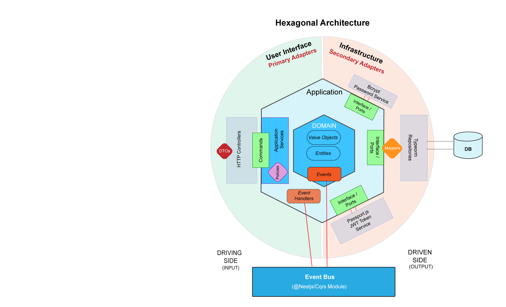

# Movie Management System

A RESTful API for managing movies, built with NestJS and structured according to Domain-Driven Design principles.

## Project Description

This Movie Management System allows:
- User registration and authentication (managers and customers)
- Movie management with age restrictions and multiple sessions
- Ticket purchasing
- Movie watching (with valid tickets)
- User watch history tracking


## Architecture Decision
This project adopts Domain-Driven Design principles. So we have 2 phases for the design:
- Strategic Design
- Tactical Design

### Startegic Design
This step should be done with business experts, but here we simulate the process.

#### a. Identifying the Overall Domain:
For our Movie Management System, the high-level domain is Cinema Operations Management

#### b. Identifying Subdomains:
If we divide submodules by different domain experts, we will have:
- Authentication & security experts (Common subdomain - Auth module)
- Movie content & event management experts (Core subdomain - Movie module )
- Sales experts (Supporting subdomain - Ticket module)

#### c. Event Storming:
1. First we identify all events which could happen in the system:


2. We add commands which produce these events, the system which the command is invoked on, the policies which are triggered when each event happen. Here for the sake of this project's requirements we only implement part of these events. it will be something like:

[Medium Article - Image Source](https://medium.com/@samar.benamar/event-storming-the-storm-that-cleans-up-the-mess-b2bb578db7c)

- a sample register flow would be:


After identifying all events, commands and policies on events, the strategic design which is done with business experts is finished and we can proceed to technical development phase based on the decided strategic design.

## Process Flows
Below is the Buy Ticket process flow demonstrating DDD elements and interrelation between modules and how each module is doing the part of flow which belongs to the domain subject:


For a detailed breakdown of all process flows in the app, check out the [Process Flows Documentation](PROCESS_FLOWS.md).


### Tactical Design
- challenge:
There are limitless variations of the approaches taken for Domain Driven Design, specially in the tactical phase.
Some use CQRS, some use Hegagonal architecture, Clean architecture, etc. even for hexagonal architecture there are lots of variations between the parts and project structures implemented, so we needed to make a decision for what to use, so here I considered our project main requirements:
+ Keep the project well organised and SIMPLE
+ The project should be adaptable to new technologies (loosely coupled)
so I decided to hexagonal(Ports and Adapters) architecture, so that our core app does not depend at all on the infrastructure layer technologies, because all our core app knows is it exposes an interface(ports) which the infrastructure(typeorm repository, Passport.js, etc) should implement to communicate with core app services. so we can easily switch database technology or any other infrastructure used without changing anything in the core module. Also this implementation makes our app test friendly, we can mock the respository service easily by implementing the interface. Below is a diagram of the advantages of decoupling with interfaces(ports):


Here is what the main architecture of each subdomain of our app looks like:



And here is how the architecture fits inside the Nestjs's architecture:


This hexagonal architecture implementation follows Domain-Driven Design principles and employs the CQRS pattern(partially to keep the project simple but organized) through NestJS's event handling system. The architecture consists of several key layers:

### Key Components:
1. **Domain Layer (Core):**
   - Contains pure business logic and rules
   - All domain objects are immutable and encapsulated
   - Events are triggered by domain state changes
   - No dependencies on external layers or frameworks

2. **Application Layer:**
   - Orchestrates domain objects and workflows
   - Handles commands
   - Contains event handlers for domain events
   - Implements use cases through services

3. **Adapters Layer:**
   - **Primary (Driving) Side:** Handles incoming requests
   - **Secondary (Driven) Side:** Manages external services and persistence
   - **Adapters Mappers:** translate between external and internal formats

4. **Event System**
   - **Event Bus (@nestjs/cqrs)** enables loose coupling between modules
   - Domain events represent significant state changes
   - Event handlers handle side effects and cross-module communication
   - Asynchronous processing of business workflows


## Technology Stack

- **Framework:** NestJS 9.x
- **Language:** TypeScript 4.x
- **Database:** PostgreSQL (production), SQLite (testing)
- **ORM:** TypeORM
- **Authentication:** JWT, Passport
- **Testing:** Jest
- **Documentation:** Swagger/OpenAPI
- **Architecture Patterns:** Domain-Driven Design, Hexagonal Architecture

## Getting Started

### Prerequisites

- Node.js 14.x or later
- npm 7.x or later
- PostgreSQL (for production)

### Installation

1. Clone the repository:
   ```bash
   git clone https://github.com/yourusername/movie-management-system.git
   cd movie-management-system
   ```

2. Install dependencies:
   ```bash
   npm install
   ```

3. Set up environment variables:
   ```bash
   cp .env.example .env
   # Edit .env with your configuration
   ```

4. Start the development server:
   ```bash
   npm run start:dev
   ```

### Testing

Run unit tests:
```bash
npm test
```

Run end-to-end tests:
```bash
npm run test:e2e
```

### API Documentation

Once the application is running, you can access the Swagger documentation at:
```
http://localhost:3000/api
```

## Project Structure

```
src/
├── modules/                        # Feature modules (bounded contexts)
│   ├── auth/                       # Authentication bounded context
│   │   ├── domain/                 # Domain layer (hexagon core)
│   │   │   ├── models/             # Entities, aggregates, value objects
│   │   │   ├── events/             # Domain events
│   │   │   ├── ports/              # Secondary ports (interfaces)
│   │   │   └── services/           # Domain services
│   │   ├── application/            # Application layer 
│   │   │   ├── services/           # Use case orchestration
│   │   │   └── commands/           # CQRS commands
│   │   ├── adapters/               # Adapters layer
│   │   │   ├── primary/            # Driving adapters (controllers)
│   │   │   └── secondary/          # Driven adapters (repositories)
│   │   └── auth.module.ts          # NestJS module configuration
│   ├── movie/                      # Movie management context
│   └── ticket/                     # Ticket management context
├── common/                         # Shared code
│   ├── filters/                    # Global exception filters
│   ├── interceptors/               # Global interceptors
│   └── decorators/                 # Custom decorators
└── main.ts                         # Application entry point
```

## Implementation Approach

### Domain-Driven Design

The application is structured around key business domains:
1. **Authentication Domain:** User management, login, registration
2. **Movie Domain:** Movie creation, updates, sessions
3. **Ticket Domain:** Ticket purchases, validation

Each domain follows Clean Architecture principles with clear separation of:
- **Domain Models:** Pure business logic
- **Application Services:** Use case orchestration
- **Infrastructure:** Technical implementations (databases, external services)

### Hexagonal Architecture

The hexagonal architecture (ports and adapters) allows us to:
- Keep the domain layer free from infrastructure concerns
- Easily replace implementation details (e.g., database, security providers)
- Make the system more testable by mocking adapters
- Maintain a clear boundary between business logic and technical implementations

## Development Decisions

1. **Authentication Strategy:**
   - JWT-based authentication for stateless API interactions
   - Role-based access control (RBAC) for authorization
   - Strong password hashing with bcrypt

2. **Database Approach:**
   - Repository pattern for data access abstraction
   - TypeORM for database interactions with clear domain separation
   - Entities mapped properly to domain objects

3. **Error Handling:**
   - Centralized exception handling
   - Domain-specific exceptions
   - Proper HTTP status codes and error messages

4. **Performance Considerations:**
   - Optimized database queries
   - Proper indexing strategy
   - Request timeout handling

## Challenges Faced

During development, several challenges were addressed:

1. **Maintaining Clean Architecture:**
   - Ensuring domain models remain free of infrastructure concerns
   - Avoiding anemic domain models by placing business logic appropriately

2. **TypeORM Integration:**
   - Properly mapping between domain entities and ORM entities
   - Managing relations while respecting domain boundaries

3. **Testing Strategy:**
   - Creating effective unit tests for domain logic
   - Setting up integration tests with a test database
   - Mocking external dependencies appropriately

## Future Improvements

1. **Caching Layer:** Implement Redis caching for frequently accessed data
2. **Session Conflict Detection:** Advanced algorithm to prevent double-booking
3. **Recommendation System:** Movie recommendations based on watch history
4. **Reporting Module:** Advanced analytics for managers
5. **Microservices Architecture:** Split into microservices for better scalability

## License

This project is licensed under the MIT License - see the LICENSE file for details.