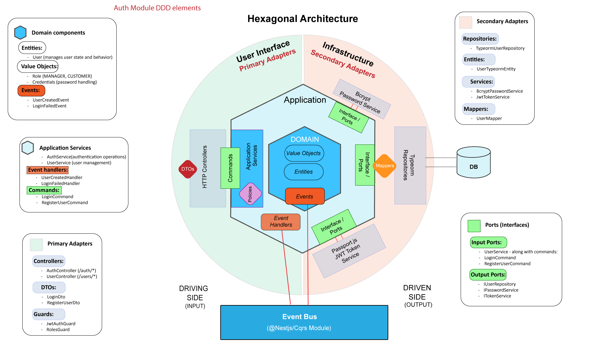

# Movie Management System

A RESTful API for managing movies, built with NestJS and structured according to Domain-Driven Design principles.

## Project Description

This Movie Management System allows:
- User registration and authentication (managers and customers)
- Movie management with age restrictions and multiple sessions
- Ticket purchasing
- Movie watching (with valid tickets)
- User watch history tracking


## Architecture Decision
This project adopts Domain-Driven Design principles. So we have 2 phases for the design:
- Strategic Design
- Tactical Design

### Startegic Design
This step should be done with business experts, but here we simulate the process.

#### a. Identifying the Overall Domain:
For our Movie Management System, the high-level domain is Cinema Operations Management

#### b. Identifying Subdomains:
If we divide submodules by different domain experts, we will have:
- Authentication & security experts (Common subdomain - Auth module)
- Movie content & event management experts (Core subdomain - Movie module )
- Sales experts (Supporting subdomain - Ticket module)

#### c. Event Storming:
1. First we identify all events which could happen in the system:


2. We add commands which produce these events, the system which the command is invoked on, the policies which are triggered when each event happen. Here for the sake of this project's requirements we only implement part of these events. it will be something like:

[Medium Article - Image Source](https://medium.com/@samar.benamar/event-storming-the-storm-that-cleans-up-the-mess-b2bb578db7c)

- a sample register flow would be:


After identifying all events, commands and policies on events, the strategic design which is done with business experts is finished and we can proceed to technical development phase based on the decided strategic design.

## Process Flows
Below is the Buy Ticket process flow demonstrating DDD elements and interrelation between modules and how each module is doing the part of flow which belongs to the domain subject:


For a detailed breakdown of all process flows in the app, check out the [Process Flows Documentation](PROCESS_FLOWS.md).


### Tactical Design
- challenge:
There are limitless variations of the approaches taken for Domain Driven Design, specially in the tactical phase.
Some use CQRS, some use Hegagonal architecture, Clean architecture, etc. even for hexagonal architecture there are lots of variations between the parts and project structures implemented, so we needed to make a decision for what to use, so here I considered our project main requirements:
+ Keep the project well organised and SIMPLE
+ The project should be adaptable to new technologies (loosely coupled)

So I decided to use hexagonal(Ports and Adapters) architecture, so that our core app does not depend at all on the infrastructure layer technologies, because all our core app knows is it exposes an interface(ports) which the infrastructure(typeorm repository, Passport.js, etc) should implement to communicate with core app services. so we can easily switch database technology or any other infrastructure used without changing anything in the core module. Also this implementation makes our app test friendly, we can mock the respository service easily by implementing the interface. Below is a diagram of the advantages of decoupling with interfaces(ports):


Here is what the main architecture of each subdomain of our app looks like:


And here is how the architecture fits inside the Nestjs's architecture:


This hexagonal architecture implementation follows Domain-Driven Design principles and employs the CQRS pattern(partially to keep the project simple but organized) through NestJS's event handling system. The architecture consists of several key layers:

### Key Components:
1. **Domain Layer (Core):**
   - Contains pure business logic and rules
   - All domain objects are immutable and encapsulated
   - Events are triggered by domain state changes
   - No dependencies on external layers or frameworks

2. **Application Layer:**
   - Orchestrates domain objects and workflows
   - Handles commands
   - Contains event handlers for domain events
   - Implements use cases through services

3. **Adapters Layer:**
   - **Primary (Driving) Side:** Handles incoming requests
   - **Secondary (Driven) Side:** Manages external services and persistence
   - **Adapters Mappers:** translate between external and internal formats

4. **Event System**
   - **Event Bus (@nestjs/cqrs)** enables loose coupling between modules
   - Domain events represent significant state changes
   - Event handlers handle side effects and cross-module communication
   - Asynchronous processing of business workflows

## Module archtiectures

### Auth module architecture



### Movie module architecture


### Ticket module architecture


## Database Schema
Below is the entity relationship diagram showing how our domain models are represented in the database:

```
┌─────────────┐       ┌──────────┐       ┌───────────┐
│    Users    │       │  Movies  │       │ Sessions  │
├─────────────┤       ├──────────┤       ├───────────┤
│ id          │       │ id       │       │ id        │
│ username    │       │ name     │       │ movieId   │──┐
│ password    │       │ ageRestr │       │ date      │  │
│ age         │       └──────┬───┘       │ timeSlot  │  │
│ role        │              │           │ roomNumber│  │
│ watchHistory│              │           │ availSeats│  │
└─────┬───────┘              │           │ bookedSeat│  │
      │                      │           └───────────┘  │
      │                      │                 ▲        │
      │                      └─────────────────┘        │
      │                                                 │
      │           ┌────────────┐                        │
      └───────────┤  Tickets   │                        │
                  ├────────────┤                        │
                  │ id         │                        │
                  │ userId     │───────────────────────┘
                  │ movieId    │
                  │ sessionId  │
                  │ purchaseDate│
                  │ used       │
                  │ usedDate   │
                  └────────────┘
```

This schema illustrates the relationships between:
- Users (customers/managers) and their tickets
- Movies and their sessions
- Tickets linking users to movie sessions

## API Endpoints Summary

Below is a summary of the main API endpoints:

| Endpoint | Method | Description | Role Access |
|----------|--------|-------------|-------------|
| `/auth/register` | POST | Register a new user | Public |
| `/auth/login` | POST | Authenticate and get token | Public |
| `/auth/profile` | GET | Get current user profile | Authenticated |
| `/users/:id` | GET | Get user by ID | Manager |
| `/movies` | GET | List all movies with filtering | Authenticated |
| `/movies/:id` | GET | Get movie by ID | Authenticated (age restricted) |
| `/movies` | POST | Create a new movie | Manager |
| `/movies/:id` | PUT | Update a movie | Manager |
| `/movies/:id` | DELETE | Delete a movie | Manager |
| `/movies/bulk` | POST | Create multiple movies | Manager |
| `/movies/bulk` | DELETE | Delete multiple movies | Manager |
| `/movies/:id/sessions` | POST | Add a session to a movie | Manager |
| `/tickets/buy` | POST | Buy a ticket for a movie session | Customer |
| `/tickets/:id/use` | POST | Use a ticket to watch a movie | Customer |
| `/tickets/unused` | GET | Get user's unused tickets | Customer |
| `/tickets/history` | GET | Get user's watch history | Customer |

For detailed request/response formats, please refer to the Swagger documentation at `/api`.

## Technology Stack

- **Framework:** NestJS 9.x
- **Language:** TypeScript 4.x
- **Database:** PostgreSQL (production), SQLite (testing)
- **ORM:** TypeORM
- **Authentication:** JWT, Passport
- **Testing:** Jest
- **Documentation:** Swagger/OpenAPI
- **Architecture Patterns:** Domain-Driven Design, Hexagonal Architecture

## Security Measures

The application implements several security features to protect user data and prevent unauthorized access:

1. **Authentication & Authorization:**
   - JWT-based token authentication with expiration
   - Role-based access control (RBAC) for endpoint authorization
   - Custom guards to validate user permissions

2. **Password Security:**
   - Passwords are hashed using bcrypt with salt rounds for protection
   - No plain-text passwords are stored in the database

3. **API Security:**
   - Helmet middleware to set HTTP security headers
   - CORS protection configured to restrict origins
   - Request validation using DTOs and class-validator

4. **Error Handling & Logging:**
   - Custom exception filters to prevent sensitive error details leakage
   - Login attempt tracking to prevent brute force attacks
   - Comprehensive logging for security events

5. **Data Protection:**
   - Input validation to prevent injection attacks
   - DTOs with property whitelisting to prevent mass assignment vulnerabilities

## Getting Started

### Prerequisites

- Node.js 16.x or later
- npm 7.x or later
- PostgreSQL (for production)

### Installation

1. Clone the repository:
   ```bash
   git clone https://github.com/Me-Baran/movie-management-system.git
   cd movie-management-system
   ```

2. Install dependencies:
   ```bash
   npm install
   ```

3. Set up environment variables:
   ```bash
   cp .env.example .env
   # Edit .env with your configuration
   ```

4. Start the development server:
   ```bash
   npm run start:dev
   ```

### Environment Variables

The application requires the following environment variables:

```
# Application
PORT=3000
NODE_ENV=development

# Database
DB_TYPE=postgres
DB_HOST=localhost
DB_PORT=5432
DB_USERNAME=postgres
DB_PASSWORD=postgres
DB_NAME=movie_management
DB_SYNCHRONIZE=true
DB_LOGGING=true

# JWT Authentication
JWT_SECRET=your-secret-key-here
JWT_EXPIRES_IN=1h
```

For testing, the app uses SQLite in-memory database by default.

### Testing

Run unit tests:
```bash
npm test
```

Run end-to-end tests:
```bash
npm run test:e2e
```

### API Documentation

Once the application is running, you can access the Swagger documentation at:
```
http://localhost:3000/api
```

## Project Structure

```
├── PROCESS_FLOWS.md                # Documentation of business processes and workflows
├── README.md                       # Project overview, setup instructions, and documentation
├── eslint.config.mjs               # ESLint configuration for code quality and consistency
├── nest-cli.json                   # NestJS CLI configuration for build and generate commands
├── package-lock.json               # Exact dependency tree for consistent installations
├── package.json                    # Project metadata and dependencies
├── src                             # Source code directory
│   ├── app.controller.spec.ts      # Unit tests for the root controller
│   ├── app.controller.ts           # Root controller for basic application endpoints
│   ├── app.module.ts               # Root module that imports and configures all feature modules
│   ├── app.service.ts              # Root service for basic application logic
│   ├── common                      # Shared utilities and middleware
│   │   ├── filters                 # Global exception filters
│   │   │   └── http-exception.filter.ts   # Custom HTTP exception handler for consistent error responses
│   │   └── interceptors            # Global interceptors for cross-cutting concerns
│   │       ├── logging.interceptor.ts     # Request/response logging for all endpoints
│   │       └── timeout.interceptor.ts     # Request timeout handler to prevent hanging requests
│   ├── main.ts                     # Application entry point - server setup and bootstrap
│   └── modules                     # Feature modules (bounded contexts)
│       ├── auth                    # Authentication bounded context
│       │   ├── adapters            # Interface adapters layer
│       │   │   ├── primary         # Driving adapters (controllers and DTOs)
│       │   │   │   ├── dtos        # Data Transfer Objects for input validation
│       │   │   │   │   ├── login.dto.ts             # Login request validation
│       │   │   │   │   └── register-user.dto.ts     # User registration validation
│       │   │   │   └── rest        # REST API controllers
│       │   │   │       ├── auth.controller.ts       # Authentication endpoints (login, register)
│       │   │   │       ├── decorators               # Custom decorators for controllers
│       │   │   │       │   └── current-user.decorator.ts   # Extract current user from request
│       │   │   │       └── user.controller.ts       # User management endpoints
│       │   │   └── secondary       # Driven adapters (repositories, external services)
│       │   │       ├── persistence # Database adapters
│       │   │       │   ├── typeorm-user.repository.ts    # TypeORM implementation of user repository
│       │   │       │   ├── user.mapper.ts                # Maps between domain and ORM entities
│       │   │       │   └── user.typeorm-entity.ts        # Database entity for users
│       │   │       └── security    # Security-related adapters
│       │   │           ├── jwt-adapter                    # JWT authentication implementation
│       │   │           │   ├── jwt-auth.guard.ts          # Guard for JWT authentication
│       │   │           │   ├── jwt-token.service.ts       # JWT token generation and validation
│       │   │           │   └── jwt.strategy.ts            # Passport JWT strategy
│       │   │           ├── password-adapter               # Password handling implementation
│       │   │           │   └── bcrypt-password.service.ts # Bcrypt password hashing
│       │   │           └── utils                          # Security utilities
│       │   │               ├── decorators                 # Security-related decorators
│       │   │               │   └── roles.decorator.ts     # Role-based access control decorator
│       │   │               └── guards                     # Security guards
│       │   │                   └── roles.guard.ts         # Role-based access control guard
│       │   ├── application     # Application layer - use cases and orchestration
│       │   │   ├── commands    # Command objects for CQRS pattern
│       │   │   │   ├── login.command.ts         # Login command data structure
│       │   │   │   └── register-user.command.ts # User registration command
│       │   │   ├── event-handlers               # Domain event handlers
│       │   │   │   ├── login-failed.handler.ts  # Handles failed login attempts
│       │   │   │   └── user-created.handler.ts  # Handles user creation events
│       │   │   ├── ports                        # Interface definitions (ports)
│       │   │   │   ├── password.service.interface.ts   # Password service interface
│       │   │   │   ├── token-service.interface.ts      # Token service interface
│       │   │   │   └── user-repository.interface.ts    # User repository interface
│       │   │   └── services                      # Application services
│       │   │       ├── auth.service.ts           # Authentication service implementation
│       │   │       └── user.service.ts           # User management service
│       │   ├── auth.module.ts                    # NestJS module for auth context
│       │   ├── domain                            # Domain layer - core business logic
│       │   │   ├── events                        # Domain events
│       │   │   │   ├── login-failed-event.ts     # Event for failed login attempts
│       │   │   │   └── user-created.event.ts     # Event for user creation
│       │   │   └── models                        # Domain models
│       │   │       ├── credentials.value-object.ts   # Value object for user credentials
│       │   │       ├── role.value-object.ts          # Value object for user roles
│       │   │       └── user.entity.ts                # User entity (aggregate root)
│       │   └── test                              # Tests for auth module
│       │       ├── integration                   # Integration tests
│       │       │   └── auth.integration.spec.ts  # Auth integration tests
│       │       └── unit                          # Unit tests
│       │           ├── application               # Tests for application layer
│       │           │   └── auth.service.spec.ts  # Auth service tests
│       │           └── domain                    # Tests for domain layer
│       │               ├── role.value-object.spec.ts  # Role value object tests
│       │               └── user.entity.spec.ts        # User entity tests
│       ├── movie                                 # Movie management bounded context
│       │   ├── adapters                          # Interface adapters layer
│       │   │   ├── primary                       # Driving adapters
│       │   │   │   ├── dtos                      # Data Transfer Objects
│       │   │   │   │   ├── bulk-create-movies.dto.ts   # Bulk movie creation validation
│       │   │   │   │   ├── bulk-delete-movies.dto.ts   # Bulk movie deletion validation
│       │   │   │   │   ├── create-movie.dto.ts         # Movie creation validation
│       │   │   │   │   ├── create-session.dto.ts       # Session creation validation
│       │   │   │   │   ├── filter-movies.dto.ts        # Movie filtering validation
│       │   │   │   │   └── update-movie.dto.ts         # Movie update validation
│       │   │   │   └── rest                      # REST controllers
│       │   │   │       └── movie.controller.ts   # Movie management endpoints
│       │   │   └── secondary                     # Driven adapters
│       │   │       └── persistence               # Database adapters
│       │   │           ├── movie.mapper.ts             # Maps between domain and ORM entities
│       │   │           ├── movie.typeorm-entity.ts     # Movie database entity
│       │   │           ├── session.typeorm-entity.ts   # Session database entity
│       │   │           └── typeorm-movie.repository.ts # TypeORM implementation of movie repository
│       │   ├── application                       # Application layer
│       │   │   ├── commands                      # Commands for CQRS
│       │   │   │   ├── add-session.command.ts         # Add session command
│       │   │   │   ├── bulk-create-movies.command.ts  # Bulk create movies command
│       │   │   │   ├── bulk-delete-movies.command.ts  # Bulk delete movies command
│       │   │   │   ├── create-movie.command.ts        # Create movie command
│       │   │   │   ├── delete-movie.command.ts        # Delete movie command
│       │   │   │   └── update-movie.command.ts        # Update movie command
│       │   │   ├── event-handlers                # Domain event handlers
│       │   │   │   ├── movie-created.handler.ts       # Handles movie creation events
│       │   │   │   └── session-created.handler.ts     # Handles session creation events
│       │   │   ├── ports                         # Interface definitions
│       │   │   │   └── movie-repository.interface.ts  # Movie repository interface
│       │   │   └── services                      # Application services
│       │   │       └── movie.service.ts                # Movie management service
│       │   ├── domain                            # Domain layer
│       │   │   ├── events                        # Domain events
│       │   │   │   ├── movie-created.event.ts          # Event for movie creation
│       │   │   │   └── session-created.event.ts        # Event for session creation
│       │   │   └── models                        # Domain models
│       │   │       ├── age-restriction.value-object.ts # Age restriction value object
│       │   │       ├── movie.entity.ts                 # Movie entity (aggregate root)
│       │   │       ├── session.entity.ts               # Session entity
│       │   │       └── time-slot.value-object.ts       # Time slot value object
│       │   ├── movie.module.ts                   # NestJS module for movie context
│       │   └── test                              # Tests for movie module
│       │       ├── integration                   # Integration tests
│       │       │   └── movie.integration.spec.ts      # Movie integration tests
│       │       └── unit                          # Unit tests
│       │           ├── application               # Tests for application layer
│       │           │   └── movie.service.spec.ts      # Movie service tests
│       │           ├── domain                    # Tests for domain layer
│       │           │   ├── age-restriction.value-object.spec.ts  # Age restriction tests
│       │           │   ├── movie.entity.spec.ts                  # Movie entity tests
│       │           │   ├── session.entity.spec.ts                # Session entity tests
│       │           │   └── time-slot.value-object.spec.ts        # Time slot tests
│       │           └── infrastructure            # Tests for infrastructure
│       │               └── movie.mapper.spec.ts        # Movie mapper tests
│       └── ticket                                # Ticket management bounded context
│           ├── adapters                          # Interface adapters layer
│           │   ├── primary                       # Driving adapters
│           │   │   ├── dtos                      # Data Transfer Objects
│           │   │   │   └── buy-ticket.dto.ts           # Ticket purchase validation
│           │   │   └── rest                      # REST controllers
│           │   │       └── ticket.controller.ts        # Ticket management endpoints
│           │   └── secondary                     # Driven adapters
│           │       └── persistence               # Database adapters
│           │           ├── ticket.mapper.ts            # Maps between domain and ORM entities
│           │           ├── ticket.typeorm-entity.ts    # Ticket database entity
│           │           └── typeorm-ticket.repositoty.ts # TypeORM implementation of ticket repository
│           ├── application                       # Application layer
│           │   ├── commands                      # Commands for CQRS
│           │   │   ├── buy-ticket.command.ts          # Buy ticket command
│           │   │   └── use-ticket.command.ts          # Use ticket command
│           │   ├── event-handlers                # Domain event handlers
│           │   │   ├── ticket-created.handler.ts      # Handles ticket creation events
│           │   │   └── ticket-used.handler.ts         # Handles ticket usage events
│           │   ├── ports                         # Interface definitions
│           │   │   └── ticket-repository.interface.ts # Ticket repository interface
│           │   └── services                      # Application services
│           │       └── ticket.service.ts               # Ticket management service
│           ├── domain                            # Domain layer
│           │   ├── events                        # Domain events
│           │   │   ├── ticket-created.event.ts         # Event for ticket creation
│           │   │   └── ticket-used-event.ts            # Event for ticket usage
│           │   └── models                        # Domain models
│           │       └── ticket.entity.ts                # Ticket entity (aggregate root)
│           ├── test                              # Tests for ticket module
│           │   ├── integration                   # Integration tests
│           │   │   └── ticket.integration.spec.ts      # Ticket integration tests
│           │   └── unit                          # Unit tests
│           │       ├── application               # Tests for application layer
│           │       │   └── ticket.service.spec.ts      # Ticket service tests
│           │       ├── domain                    # Tests for domain layer
│           │       │   └── ticket.entity.spec.ts       # Ticket entity tests
│           │       └── infrastructure            # Tests for infrastructure
│           │           └── ticket.mapper.spec.ts       # Ticket mapper tests
│           └── ticket.module.ts                  # NestJS module for ticket context
├── test                                    # E2E tests directory
│   ├── app.e2e-spec.ts                    # E2E test for the entire application
│   ├── jest-e2e.json                      # Jest configuration for E2E tests
│   └── jest-setup.ts                      # Setup file for E2E tests
├── tsconfig.build.json                    # TypeScript config for production build
└── tsconfig.json                          # TypeScript configuration
```

## Implementation Approach

### Domain-Driven Design

The application is structured around key business domains:
1. **Authentication Domain:** User management, login, registration
2. **Movie Domain:** Movie creation, updates, sessions
3. **Ticket Domain:** Ticket purchases, validation

Each domain follows Clean Architecture principles with clear separation of:
- **Domain Models:** Pure business logic
- **Application Services:** Use case orchestration
- **Infrastructure:** Technical implementations (databases, external services)

### Hexagonal Architecture

The hexagonal architecture (ports and adapters) allows us to:
- Keep the domain layer free from infrastructure concerns
- Easily replace implementation details (e.g., database, security providers)
- Make the system more testable by mocking adapters
- Maintain a clear boundary between business logic and technical implementations

## Development Decisions

1. **Authentication Strategy:**
   - JWT-based authentication for stateless API interactions
   - Role-based access control (RBAC) for authorization
   - Strong password hashing with bcrypt

2. **Database Approach:**
   - Repository pattern for data access abstraction
   - TypeORM for database interactions with clear domain separation
   - Entities mapped properly to domain objects

3. **Error Handling:**
   - Centralized exception handling
   - Domain-specific exceptions
   - Proper HTTP status codes and error messages

## Challenges Faced

During development, several challenges were addressed:

1. **Maintaining Clean Architecture:**
   - Ensuring domain models remain free of infrastructure concerns

2. **TypeORM Integration:**
   - Properly mapping between domain entities and ORM entities
   - Managing relations while respecting domain boundaries

3. **Testing Strategy:**
   - Creating effective unit tests for domain logic
   - Setting up integration tests with a test database and handling the timestamp format difference between sqlite nad postgres
   - Mocking external dependencies appropriately


### Deployment to Heroku (Template)

The repository includes a commented template for automatic deployment to Heroku in the GitHub Actions workflow file. To enable it:

1. Uncomment the deployment job in `.github/workflows/node.js.yml`
2. Set up the following secrets in your GitHub repository:
   - `HEROKU_API_KEY`: Your Heroku API key
   - `HEROKU_APP_NAME`: Your Heroku application name
   - `HEROKU_EMAIL`: Email associated with your Heroku account

3. The deployment will automatically:
   - Run after tests pass successfully
   - Deploy only when changes are pushed to main/master
   - Build the application for production
   - Deploy to your Heroku app
   - (Optional) Run database migrations

This CI/CD pipeline ensures code quality and provides a streamlined path to production deployment.

## Future Improvements

1. **Caching Layer:** Implement Redis caching for frequently accessed data
2. **Rate Limiting:** Add rate limiting to prevent DOS attacks
3. **Recommendation System:** Movie recommendations based on watch history
4. **Reporting Module:** Advanced analytics for managers
5. **Microservices Architecture:** Split into microservices for better scalability


## Resources and References

This project has been influenced by various resources on Domain-Driven Design and Hexagonal Architecture. Below are some of the key resources that contributed to the architectural decisions:

### Domain-Driven Design
- [Event Storming — The Storm That Cleans Up The Mess!](https://medium.com/@samar.benamar/event-storming-the-storm-that-cleans-up-the-mess-b2bb578db7c) by Samar Benamar

- [Domain-Driven Design](https://www.youtube.com/watch?v=o-ym035R1eY&list=PLXPfFMrWkdbe8EwRY0oBPHDmC-3oA0bP_)
- [Domain Driven Design: What You Need To Know](https://www.youtube.com/watch?v=4rhzdZIDX_k&list=PLXPfFMrWkdbe8EwRY0oBPHDmC-3oA0bP_&index=2) by Alex Hyett
- [Event Storming - what it is and why you should use it with Domain-Driven Design](https://www.youtube.com/watch?v=7LFxWgfJEeI) by Amichai Mantinband


### Hexagonal Architecture
- [Hexagonal Architecture: What You Need To Know](https://www.youtube.com/watch?v=bDWApqAUjEI&list=PLXPfFMrWkdbe8EwRY0oBPHDmC-3oA0bP_&index=3) - by 
Alex Hyett
- [Hexagonal Architecture](https://medium.com/ssense-tech/hexagonal-architecture-there-are-always-two-sides-to-every-story-bc0780ed7d9c) by Pablo Martinez
- [Relatives of Onion Architecture: Hexagonal and Clean Architecture Annotations](https://github.com/xmolecules/jmolecules/discussions/70) by @MahatmaFatalError
- [Designing Microservices Components using Hexagonal Architecture](https://www.sennder.com/tech/designing-microservices-components-using-hexagonal-architecture)

These resources have been instrumental in shaping the architecture and implementation of this project. I highly recommend them for anyone looking to deepen their understanding of DDD and Hexagonal Architecture.


## License

This project is licensed under the MIT License - see the LICENSE file for details.

